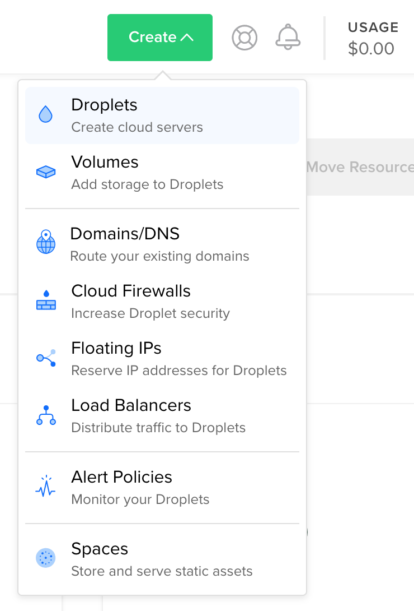
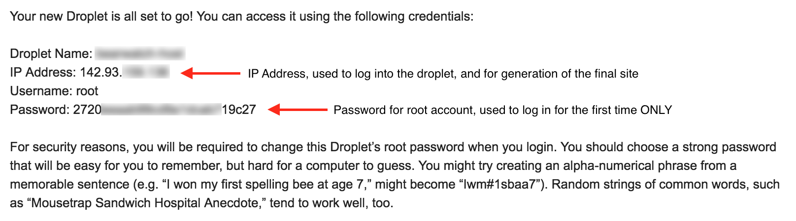
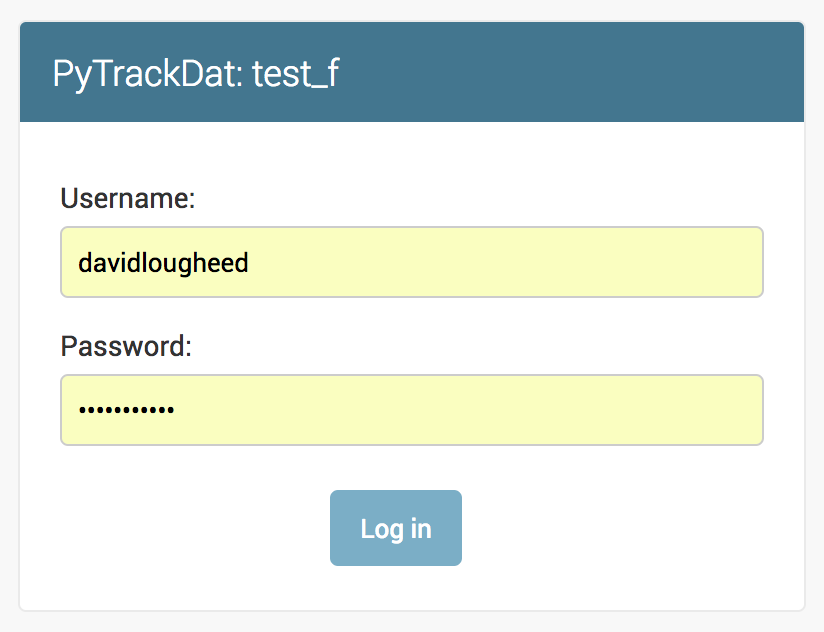
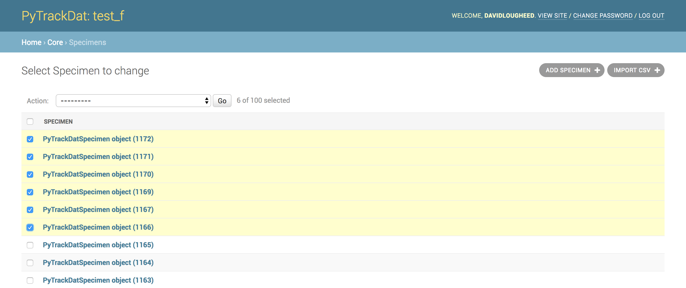
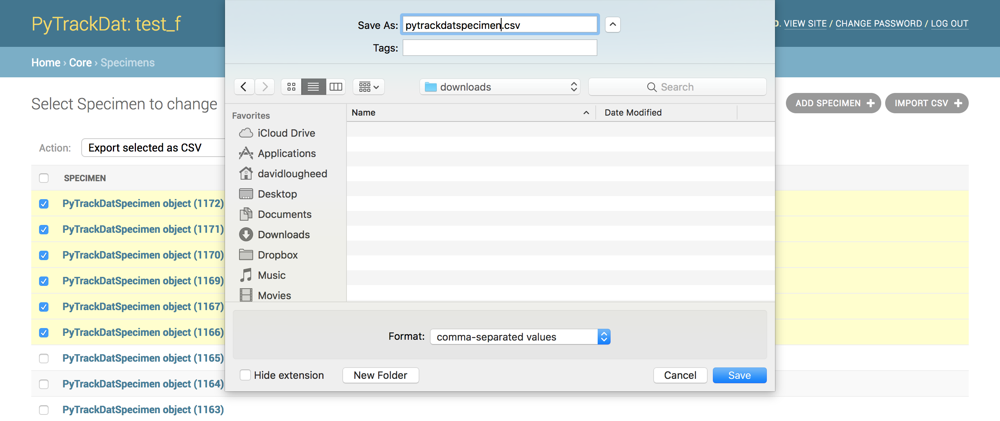
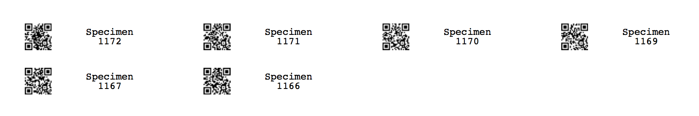

# PyTrackDat — A pipeline for online data collection and management

## Overview

PyTrackDat comprises two Python scripts that analyze and assist in converting
data and relevant metadata from `.csv` files into an online database that can
facilitate data management, manipulation, and quality control. What each of
these scripts does is outlined in this `README.md` file. Note that the care
that is taken to assemble `.csv` files before using these scripts will help
ensure that the database generated is maximally useful.


## Table of Contents

  * [Installation](#installation)
     * [Dependencies](#dependencies)
        * [Installing Python 3](#installing-python-3)
     * [(Windows Only) SSH Utilities](#windows-only-ssh-utilities)
        * [Using KiTTY](#mini-tutorial-using-kitty)
        * [Using WinSCP](#mini-tutorial-using-winscp)
     * [Getting PyTrackDat](#getting-pytrackdat)
  * [Running PyTrackDat](#running-pytrackdat)
     * [(Optional) Step 1: Data Analyzer](#optional-step-1-data-analyzer)
     * [Step 2: Design File Layout and Customization](#step-2-design-file-layout-and-customization)
        * [Design File Customization](#design-file-customization)
        * [Design File Specification](#design-file-specification)
        * [Blocks](#blocks)
           * [Block: Row 1](#block-row-1)
           * [Block: Following Rows – Field Descriptions](#block-following-rows--field-descriptions)
              * [CSV Column Name](#csv-column-name)
              * [Database Field Name](#database-field-name)
              * [Data Type](#data-type)
              * [Nullable?](#nullable)
              * [Null Values](#null-values)
              * [Default](#default)
              * [Description](#description)
              * [Type-Specific Settings](#type-specific-settings)
        * [Data Type Descriptions](#data-type-descriptions)
           * [auto key: Automatic Primary Key](#auto-key-automatic-primary-key)
           * [manual key: Manually-Specified Primary Key](#manual-key-manually-specified-primary-key)
           * [integer: Integer (Negative or Positive Whole Number)](#integer-integer-negative-or-positive-whole-number)
           * [float: Floating Point Number (Non-Fixed Precision Decimal)](#float-floating-point-number-non-fixed-precision-decimal)
           * [decimal: Fixed-Precision Decimal Number](#decimal-fixed-precision-decimal-number)
           * [boolean: Boolean (True or False) Value](#boolean-boolean-true-or-false-value)
           * [text: Fixed- or Unbounded-Length Text](#text-fixed--or-unbounded-length-text)
           * [date: Date](#date-date)
           * [time: Time](#time-time)
           * [foreign key: Foreign Key (Cross-Relation)](#foreign-key-foreign-key-cross-relation)
     * [Step 3: Database Generator](#step-3-database-generator)
     * [Step 4: Testing](#step-4-testing)
     * [Step 5: Deploying the Application](#step-5-deploying-the-application)
        * [Deploying the End Result on DigitalOcean](#deploying-the-end-result-on-digitalocean)
        * [Deploying the End Result on an Existing Linux Server](#deploying-the-end-result-on-an-existing-linux-server)
  * [Worked Example](#worked-example)
  * [Updating the Schema](#updating-the-schema)
     * [Updating the site on DigitalOcean](#updating-the-site-on-digitalocean)
  * [Using a PyTrackDat Application](#using-a-pytrackdat-application)
     * [Introduction](#introduction)
     * [Importing Data](#importing-data)
     * [Exporting Data](#exporting-data)
     * [Exporting Labels with baRcodeR](#exporting-labels-with-barcoder)


## Installation

### Dependencies

Make sure that Python 3 and `pip3` are installed.

If Python 3 is already installed, update `pip3` to the latest version with the
following command, run in a Terminal window (macOS/Linux) or in Command Prompt
(Windows):

**macOS/Linux:**

```bash
pip3 install --upgrade pip
```

**Windows:**

```cmd
pip install --upgrade pip
```


#### Installing Python 3

For most new Linux distributions, Python 3 should come pre-installed.

For macOS or Windows, please go to the
[official Python website](https://www.python.org/downloads/)
and download the latest version of Python 3 (as of the time of writing, 3.7.1).
Run the installer downloaded from this site and follow the instructions
on-screen.

##### Important: Special Windows Installation Instructions

When installing Python 3 on Windows, **make sure** to check the following
checkbox ("Add Python 3 to PATH"), which will appear on the first step of the
installation process:


This ensures that Python 3 and `pip` are available from the Command Prompt.


### (Windows Only) SSH Utilities

If you already have SSH and SCP utilities installed, or are not running
Windows, this step can be skipped.

Windows does not include any programs for accessing remote servers or copying
files to them. Both of these actions are needed when deploying a PyTrackDat
application to a remote server. However, there are free utilities available
for download which can help with these tasks.

To download the two utilities needed, visit
[KiTTY's download page](http://www.9bis.net/kitty/?page=Download) and download
the `kitty_portable.exe`. Then, visit
[WinSCP's download page](https://winscp.net/eng/downloads.php) and download
the portable WinSCP version. Make sure to extract the WinSCP `.zip` file before
running the executable `WinSCP.exe` inside. The first executable provides a way
to access remote servers, and the second executable allows the copying of files
to remote servers.


#### Mini-Tutorial: Using KiTTY

KiTTY is a tool for logging into and remotely administering servers via a
command-line interface. This remote administration is useful when deploying a
PyTrackDat application to a remote server.

We have prepared [a mini-tutorial](mini-tutorials/KiTTY.md)
on using KiTTY on a Windows computer.


#### Mini-Tutorial: Using WinSCP

WinSCP is a tool for copying files to a remote server using a Windows computer.
A tool similar to this must be used to copy the PyTrackDat application onto a
server for "production" (i.e. real) use.

We have prepared [a mini-tutorial](mini-tutorials/WinSCP.md)
on using WinSCP.


### Getting PyTrackDat

The easiest way to download PyTrackDat is through PyPI (the Python Package
Index) using `pip`.

To download the latest stable release, run the following command:
 
**macOS/Linux:**

```bash
pip3 install pytrackdat
```

**Windows:**

```cmd
pip install pytrackdat
```

Once downloaded, open a Terminal window (macOS/Linux) or a Command Prompt
(Windows) and `cd` to a working directory where you want your PyTrackDat files
to live:

**macOS/Linux:**

```bash
cd /path/to/pytrackdat
```

**Windows:**

```cmd
cd \path\to\pytrackdat
```

> Getting Development Versions (Advanced Users Only)
>
> To get the latest development version of PyTrackDat, clone the repository
> (provided Git is installed) using the following command in a Terminal or
> Command Prompt window:
> 
> ```git clone https://github.com/ColauttiLab/PyTrackDat.git```


## Running PyTrackDat

### (Optional) Step 1: Data Analyzer

PyTrackDat includes an automatic data analyzer which can read a one or a series
of CSV files in (i.e. data files with variable names in the headers), as well
as their desired relation names, and generate a PyTrackDat **design file**,
which contains human-readable CSV-formatted instructions for the structure of
the database. This design file is not final, and should be checked over and
added to/edited by a human. However, it provides a good starting point for
generating a database for a particular dataset.

To run the data analyzer on one or more CSV-formatted data files, run the
following command:

```bash
ptd-analyze design.csv sample_type_1 samples1.csv sample_type_2 samples2.csv [...]
```

Where `design.csv` is the name of the design file to output, and
`sample_type_1` and `sample_type_2` are singular terms for the types of entries
stored in `samples1.csv` and `samples2.csv`, respectively.  Feel free to add
more sample types (with corresponding data files) as necessary for your
dataset, or leave out `sample_type_2` and `samples2.csv` if only one data type
is necessary for the database.


### Step 2: Design File Layout and Customization

A PyTrackDat design file contains specifications for all tables in the database
within a single CSV file. The file consists of 'blocks', each of which
corresponds to the specification for a single table, based on each of the CSV
files passed to the script. Blocks are separated by blank lines.

A single block may look like this:

<table>
<tr>
    <th>my_sample</th>
    <th>new field name</th>
    <th>data type</th>
    <th>nullable?</th>
    <th>null values</th>
    <th>default</th>
    <th>description</th>
    <th colspan="2">additional fields...</th>
</tr>
<tr>
    <td></td>
    <td>sample_id</td>
    <td>auto key</td>
    <td></td>
    <td></td>
    <td></td>
    <td>Unique automatically-generated sample identifier.</td>
    <td></td>
    <td></td>
</tr>
<tr>
    <td>Date</td>
    <td>date</td>
    <td>integer</td>
    <td>false</td>
    <td></td>
    <td></td>
    <td>Date the sample was collected.</td>
    <td></td>
    <td></td>
</tr>
<tr>
    <td>Site ID</td>
    <td>site_id</td>
    <td>foreign key</td>
    <td>false</td>
    <td></td>
    <td></td>
    <td>Site where the sample was found.</td>
    <td></td>
    <td></td>
</tr>
<tr><td colspan="9">...</td></tr>
</table>

Design files should **not** be left as-is after generation via `ptd-analyze`.
The script does its best to infer data types from the columns, but is not
guaranteed to do this perfectly. Additionally, it is best practice to add a
**field description** (under the *description* header) to provide human users
additional information about what type of data is stored in the field.

For each generated design file, users should examine the file using the
following checklist:

1. Check that data types and type-specific options are correct for each field
2. Add human-readable **descriptions** for each field
3. Change desired **foreign keys** from their detected data type to the foreign
   key data type, following the
   [foreign key documentation](#foreign-key-foreign-key-cross-relation) to link
   them to the correct table.
   
#### Design File Customization

In almost all cases, there are data types and settings that will be impossible
for the `analyze.py` script to detect. For example, a **foreign key**, which is
a data type that allows a row in a table to refer to a different row in either
the same table or a different table, cannot be automatically detected. Foreign
keys are very useful for reducing data duplication and encoding complex data
relationships.

In other cases, it may be desirable to limit a field to a range of data types.
For example, if a specimen can be one of four species, it is desirable to make
a text field which can only store any of these four species' names. The analyze
script does its best to detect these instances, but it may not detect
**all possible choices**. Thus, text fields with automatically-detected choice
limitations should be verified manually and if needed, edited.

#### Design File Specification

#### Blocks

Blocks must be separated by at least one blank line in the CSV (i.e. 2
newlines.)

##### Block: Row 1

The first row of a block contains only one piece of information: the name of
the entity being represented, in singular form (for example, "sample")
contained in the first column. The other columns of the block's first row are
ignored, but can be used as column headers to make the design file more
human-readable.

Thus, a block's first (header) row may look like this:

<table>
<tr>
<td><strong>sample</strong></td>
<td>this is ignored</td>
<td>as is this</td>
<td>...</td>
</tr>
</table>

What this means is that the block in the design file represents a "sample",
i.e. one entry in the block's equivalent table in the database contains a
single sample's data.

The analyzer will include column headers in the first row in order to aid 
understanding and possibly allow easier modification of the analyzer output.

##### Block: Following Rows – Field Descriptions

The following series of rows in a design file block contain a list of field
descriptions, which are analogous to columns in a standard spreadsheet layout.
Each database field corresponds to each one of these rows in the design file.

The generic format for a design file field description row is the following:

<table>
<tr>
<td>CSV Column Name</td>
<td>Database Field Name</td>
<td>Data Type</td>
<td>Nullable?</td>
<td>Null Values</td>
<td>Default</td>
<td>Description</td>
<td>Additional fields...</td>
</tr>
</table>

Each of these columns in the field description row has specific acceptable
values which directly decide the resulting database structure. As such, it is
important to double-check these values if the automatic analyzer is used.

###### CSV Column Name

This cell should correspond exactly to the column name in the original data CSV
which stores data for field being described.

###### Database Field Name

This cell contains the name of the field as it will appear in the database (as
decided by the `analyze.py` script). It should only contain lowercase
characters, numbers, and underscores.

###### Data Type

This cell contains the data type of the field in question. It can assume one of
the following values:

```
auto key
manual key
foreign key
integer
float
decimal
boolean
text
date
time
```

This dictates what values can be stored in the field in the database. In
general, databases are much stricter (as compared to spreadsheet programs such
as Excel) with data typing, which prevents incorrect data values from being
entered and allows additional operations on types that allow them (such as the
addition of integers).

For a description of which values are acceptable for each data type, see the
"Data Type Descriptions" section below.

###### Nullable?

This cell contains a boolean (true or false) value which specifies whether the
value of the field in the database can be `NULL`. If the field contains any
value other than "true", "false" is inferred. Null is a special value which has
implications on data representation.

A variable field is **nullable** if it can be assigned either a value or
`null`, signifying that for a specific table row (e.g. an individual or
observation) there is no value assignable.

###### Null Values

This cell contains a semicolon-separated list (`;`, optionally with surrounding
spaces to make the cell contents more readable) of values in the data CSV file
which will be converted to a `NULL` value in the database. 

Note that if this cell contains multiple entries, **information is being
lost**, since multiple values in the original data are mapped to a single value
in the database, thus preventing the original data from being recovered
identically.

An example of where multiple values could be useful is the following:

```NA; N/A```

In this case, these two values mean the same thing to a human reader but are
completely different to the computer. If `NA` is, for example, the only
possible non-integer value in an integer field, it would make sense to map it
to `NULL`.

###### Default

This cell contains a value, of the same type as would appear in the data CSV
file, specifying the default value for the field in the database.

Default values are used as the starting point when inputting a value into a
field in the GUI.


These values are also used when no value is provided for a field when importing
a CSV file. Don't set a default if you want a blank CSV entry to stay blank (or
`null`, depending on settings) in the database.

###### Description

This cell should contain a succinct and comprehensive description of what the
field means in the context of the dataset the database is to contain, including
explanations of possible values if non-obvious. 

It is also used to display help text below the fields in the database
single-item entry GUI.

###### Type-Specific Settings

Any cell after the description cell is type-specific and the valid values
depend on what data type the field has. There can be more than one
type-specific setting available, and the exact number also depends on the
field's type. For a description of each data type, including type-specific
setting options, see below.

#### Data Type Descriptions

The following are all the data types currently supported by PyTrackDat.
**Watch out** for additional type-specific settings for some data types.
These often can restrict the possible values that can be stored by the field
in the database, and are useful for data integrity purposes.

Some of these type-specific settings may be **automatically detected** by the
`ptd-analyze` script; these should be reviewed manually to make sure they cover
all possible values which can be stored in the field.

##### `auto key`: Automatic Primary Key

Automatic primary key (identifier) for a database row; stored as an integer
which starts at 1 and is increased by 1 for every row added to a table.

Deletion of a row does not lead to re-assigning IDs above the now-deleted row's
ID; IDs are fixed as long as the database is not completely re-created.

###### Design File Information

The following design file cells are **ignored** for `auto key`:

```
CSV Column Name, Nullable, Null Values, Default
```

Automatic primary keys are **never** nullable.

###### Type-Specific Settings

**No** type-specific settings are available for `auto key`.

##### `manual key`: Manually-Specified Primary Key

Manually-specified primary key (identifier, e.g. a unique collection number, a
sample numer in a tissue archive, or some other uniquely-identifying piece of
information for each row in the table) for a database row; stored as text. The
value must be specified by the user when adding data to the database.

Manually-specified primary keys must be **unique** for a given row
(/observation).

###### Design File Information

The following design file cells are **ignored** for `manual key`:

```
Nullable, Null Values, Default
```

Manually-specified primary keys are **never** nullable.

###### Type-Specific Settings

**No** type-specific settings are available for `manual key`.

##### `integer`: Integer (Negative or Positive Whole Number)

Integers can be between -9 223 372 036 854 775 808 and
9 223 372 036 854 775 807. If a bigger-capacity field is needed, use a
`text`-type field instead.

###### Type-Specific Settings

**No** type-specific settings are available for `integer`.

##### `float`: Floating Point Number (Non-Fixed Precision Decimal)

Floating-point numbers can store a huge range of numbers, including numbers
with decimal points. However, there are precision issues, and
**whenever possible** the `decimal` type should be used instead to prevent
floating-point-specific errors. 

###### Type-Specific Settings

**No** type-specific settings are available for `float`.

##### `decimal`: Fixed-Precision Decimal Number

Decimal-typed numbers can store fixed-precision decimal numbers. Both the
overall maximum length and decimal precision must be specified, in number of
digits. This type is useful for encoding significant figures and **avoiding**
floating-point-specific errors.

###### Type-Specific Settings

The `decimal` type requires two type-specific settings:

  1. `max length`: The maximum length a number can be, in digits; includes the
     decimal portion of the number.
  1. `precision`: The number of digits after the decimal. Will be the same for
     any value stored in the database, with the end 0-padded if necessary.

For example, a `decimal` field with a `max length` of 10 and a `precision` of 4
can store numbers such as `50.2300` or `-999999.9999` or `999999.9999` (as a 
negative sign does not count as a digit) but **cannot** store `1000000.0000`
because it is too long.

##### `boolean`: Boolean (True or False) Value

Boolean values are either `true` or `false`. If the field is made nullable, an
additional option is added, `NULL` (or unknown). If more than 3 values are
needed (for example if there are two types of unknown values), a text field
with the `choices` setting should be used.

###### Type-Specific Settings

**No** type-specific settings are available for `boolean`.

##### `text`: Fixed- or Unbounded-Length Text

Text fields can store almost any value, unless special restrictions are put in
place to restrict their domain. These fields are often useful in situations
where it does not make sense to restrict the column to certain values; for
example in the case of a `description` field.

Text fields can optionally be limited by any combination of:

  1. A certain maximum character length. Values extending beyond this maximum
     length will not be accepted.
     
  1. A list of specific values (think of this as an internal representation of
     a "dropdown"-type input, where only a limited range of values are
     acceptable). For example, consider a specimen table's `sex` field, where
     values should be limited to `male`, `female`, and possibly `unknown`.

These limitations are controlled by the type-specific settings below.

###### Type-Specific Settings

The `text` type optionally can take up two type-specific settings:

  1. `max length`: The maximum length of the contents in the field in terms of
     number of characters.
  1. `options`: A semicolon-separated list of possible values the text field
     can take on. Limiting the domain of a field can be useful to speed up data
     entry, prevent typos, and restrict the domain of a field to exactly what
     is desired.

##### `date`: Date

Represents a date, including month and year. Does **not** include any time
information; for times, use a second column with the `time` data type
(described below). At the moment, no timezone information is stored, which
should be tracked manually (or put in the field description.)

**Currently, PyTrackDat only accepts the `YYYY-MM-DD` format for dates.**

###### Type-Specific Settings

**No** type-specific settings are available for `date`.

##### `time`: Time

Represents a time, including minutes and seconds. If seconds are left out in
any passed values, the default seconds value is `0`. At the moment, no timezone
information is stored, which should be tracked manually (or put in the field
description).

Currently, PyTrackDat **only accepts** the `HH:MM` or `HH:MM:SS` **24 hour**
formats for times.

###### Type-Specific Settings

**No** type-specific settings are available for `time`.

##### `foreign key`: Foreign Key (Cross-Relation)

Foreign keys are one of the most powerful features of relational databases, and
in fact are what make then "relational" at all. A foreign key is a field on one
table which refers to the **primary key** of a row in *another* table (and in
fact, can refer to another row in the *same* table as well.)

This lets rows refer to one another, and can be used to prevent data
duplication. Reducing data duplication is important in preventing contradictory
information in a dataset. 

###### Type-Specific Settings

The `foreign key` type requires one type-specific setting:

  1. `target`: The table which the foreign key field is pointing to. Remember
     that table names are specified in the first column of the first row of
     a block in the design file.
     
For example, if a row in a table called `sample` refers to a row in a table
called `site`, the `target` setting would be `site`. This could have the
semantic meaning that, whenever a value is present in a row with the
`foreign key` field set, that `sample` entry was collected at the specified
`site` entry (representing an actual collection site).

This allows rows to be linked together. `target` **does not** have to refer to
a different table; the same table could be specified, allowing rows in a table
to link to other rows in the same table.


### Step 3: Database Generator

The core of PyTrackDat is a database generator script, which uses a provided
CSV design file (see above for the format) to generate a database along with a
web application which can be used to administer it. The generated software is
powered by the [Django framework](https://www.djangoproject.com/).

To run the database generator on a design file (ex. `design.csv`), run the
following command:

```bash
ptd-generate design.csv site_name
```

Where `design.csv` is a path to the design file and `site_name` is the name of
the web application that will be generated.

The script will ask if the version being built is a 'production build'. Answer
`n` (no) for now.

> **What is a production build?**
>
> A "production build" of an application (as opposed to a "development build")
> is the version of the application that will be used by all the users of the
> program, and is considered a *usable* version. The easiest way to understand
> a production build is to consider the opposite, a development build. These
> versions of the application are only used for making sure it works.
> 
> In the context of PyTrackDat, a production build is one that can be used by
> any designated users and will store the "real" data. New data entered will be
> considered part of the actual datset. A development build **will not** work
> in production, and is simply used to make sure everything works first.
> 
> Additional information must be provided to a production PyTrackDat build,
> specifically the URL of the server onto which the application will be
> deployed (i.e. set up and ran).

> **Note about PyTrackDat development builds**
> PyTrackDat application development builds cannot export baRcodeR labels from
> the web interface. This is a known issue and currently unfixable due to R
> and Python compatibility issues.

It will also prompt for the details of an administrative user. Enter in a
username and password for testing purposes. The 'email' field is optional.

This will output a zip file, `site_name.zip`, in the PyTrackDat project
directory. This package will be used to deploy the site.


### Step 4: Testing

To test the web application from the PyTrackDat directory, first change to the
site directory within the temporary work directory, `tmp`, which PyTrackDat
will create, replacing `site_name_here` with the site name that you assigned in
the previous (generator) step. Then, activate the Python virtual environment.
These actions can be done with the following commands:

**macOS/Linux:**

```bash
cd tmp/site_name_here
source site_env/bin/activate
```

**Windows:**

```cmd
cd tmp\site_name_here
site_env\Scripts\activate.bat
```

Then, run the development server from the command line with the following
command, and navigate to the application in your web browser at
`127.0.0.1:8000`:

**macOS/Linux:**

```bash
python3 ./manage.py runserver
```

**Windows:**

```cmd
python manage.py runserver
```

While the development server is running, you can explore the site the same way
you will be able to once it is finalized and deployed on a server. This is the
time to check and make sure the data format is correct, importing and exporting
your data works, and everything is behaving as expected.

Here is an overview checklist of what should be verified using this development
version of the application

 1. The data format, including names, descriptions, and types appears correct
    and corresponds with what will appear in the data file imported.
 1. All necessary tables are present.
 1. All foreign keys (inter/intra-table links) are correct and work as
    expected.
 1. Data types with an enforced choice of values include all desired choices,
    including ones for future data that **may not be used yet**.
 1. Data import works with data CSV files (if applicable).
 1. Data export works and appears as expected.

Once you are done verifying, the server can be stopped. To do this, press
`Ctrl-C` in the terminal window where the server is running.

Afterwards, to deactivate the site's virtual environment, type in the following
command:

```bash
deactivate
```


### Step 5: Deploying the Application

It is now time to deploy the final version of the application on a server. This
allows the application to be accessed at all times, from anywhere connected to
the internet. User accounts are still used to restrict access to the data. Just
because the server is publically accessible doesn't mean the data are!

There are multiple options for deployment. Below is a guide for deploying on
a new "Virtual Private Server" (VPS) on the DigitalOcean service. For more
advanced users, there is also a guide for deploying on an existing server
(though many of the steps will be similar to DigitalOcean setup).

> **Important Note:** DigitalOcean is **NOT** required to deploy PyTrackDat.
> Any server running an operating system which can host Docker containers is
> sufficient. DigitalOcean is a paid service; this may be restrictive to some.
> Free options include adapting an existing computer with a world-accessible
> IP address or using Amazon AWS' free tier (which only lasts 12 months.)

Instructions are written for Ubuntu Server 18.04 or 16.04 LTS; other
distributions may require slightly different procedures.


#### Deploying the End Result on DigitalOcean

DigitalOcean is a cost-effective VPS (virtual private server) hosting provider.
For $5 USD per month, users can create a server on which the created web
application and database can be hosted. For an additional $1 USD per month,
automatic backups can be enabled.

If you already have a server on which the application can be deployed, see the
section below. The DigitalOcean service provider is not specifically required
to run the application.


##### Step 1: Create a DigitalOcean account

Create a DigitalOcean account on their
[signup page](https://cloud.digitalocean.com/registrations/new). Confirm the
email used to create the account.
 
Make sure to enter in payment details that will allow a recurring charge of $5
USD per month (as of the time of writing, the cheapest Droplet/VPS that one can
create) for hosting the application. 


##### Step 2: Create a new droplet (virtual machine)

Once logged into the DigitalOcean dashboard, create a new virtual machine by
clicking the "Create" button and selecting "Droplets".



Select "Ubuntu 18.04 x64" for the operating system.


For PyTrackDat, the smallest droplet size ($5 USD per month) is more than
adequate, and the most cost effective solution:


For an additional $1 USD per month, automatic backups can be enabled to keep
historical versions of the whole droplet. This may be useful for data integrity
and restoring purposes.


Choose a data centre region closest to where most users will be accessing the
database, for maximum performance.


Finally, choose a hostname, which can only contain alphanumeric characters,
dashes, and periods. This uniquely identifies the droplet within the account,
and press "Create".


An email will be sent to the address used to register the account. It will
contain the newly-created droplet's IP address (4 numbers, separated by
periods) and root password. These are used for **logging in** to the droplet,
and for creating the **production** (final) version of the PyTrackDat
application, which will be uploaded to the server.




##### Step 3: Log into the new droplet and set it up

> **Note for Windows Users**
> 
> The DigitalOcean tutorials assume the user has a Linux or macOS system, and
> in general server administration with these operating systems is much more
> straightforward. However, by downloading the KiTTY utility mentioned in the
> Dependencies section of this tutorial, SSH can be used on Windows as well.
> Whenever a tutorial mentions a command involving `ssh username@server ...`,
> KiTTY can be used instead. Follow our
> [mini-tutorial](mini-tutorials/KiTTY.md) to learn how to sign into a droplet.

Follow DigitalOcean's [initial server setup](https://www.digitalocean.com/community/tutorials/initial-server-setup-with-ubuntu-18-04)
guide to set up a new user account and a basic firewall on the new droplet.

After creating a new account and following the other instructions in the guide,
disconnect from the `ssh` session by using the following command:

```bash
exit
```

Then re-connect to the droplet using the newly-created non-root user account,
typing in the password entered for the new user:

```bash
ssh your_username@your.ip.address.here
```

> **Note for Windows users:** Use the same, alternate method of accessing the
> remote server as before, using the [mini-tutorial](mini-tutorials/KiTTY.md)
> provided and described above.

Now the virtual machine is ready for installing the software needed to host the
PyTrackDat application.

Steps 3 and 6 will take place on the droplet, and steps 4 and 5 will take place
mostly on the local machine (your own computer).


##### Step 4: Install Docker and Docker Compose

###### Docker

Docker is a "container platform" which allows web applications to run inside
their own sub-environments. The resulting PyTrackDat applications generated
by the scripts are set up as Docker containers to make deploying them easier.

Docker must be installed on any server being used to host a PyTrackDat
application.

Follow DigitalOcean's [instruction guide](https://www.digitalocean.com/community/tutorials/how-to-install-and-use-docker-on-ubuntu-18-04),
following only **steps 1 and 2**, to install Docker on the newly-created
droplet.

> Further steps cover knowledge not needed for this tutorial, although it may
> be helpful for further understanding the Docker platform.

###### Docker Compose

Docker Compose is a system for orchestrating multiple Docker containers at once
in a way which makes it easy to put containers online or take them offline.

Install Docker Compose on the droplet by following DigitalOcean's
[Docker Compose instruction guide](https://www.digitalocean.com/community/tutorials/how-to-install-docker-compose-on-ubuntu-18-04),
following only **step 1**.


##### Step 5: Build the application's production version (on your own computer)

*See the [above aside](#step-3-database-generator), entitled "what is a 
production build?", for more information on why this process is needed.*

To build the production version of the database application, the `ptd-generate`
script must be run again on your **local** computer (i.e. not the new droplet),
this time answering `y` (yes) to the question `Is this a production build?`:

```bash
ptd-generate design.csv site_name
```

The script will prompt for a URL. This must match the URL that will be used to
access the site. It can also be an IP address. Whatever value is specified
should not contain `http://`, `https://`, or a trailing slash.

```
Please enter the production site URL, without 'www.' or 'http://': 
```

If a domain name has been purchased (which is outside the scope of this
tutorial), additional steps will need to be taken to attach it to the
droplet. Nonetheless, the domain name should be entered at this step.

If an IP address is being used to access the droplet (a no-cost option and
recommended if the droplet is just being used to host the database), enter that
into this prompt. The IP address has already been used in this tutorial to log
into the droplet. For example, one could enter the following:

```
Please enter the production site URL, without 'www.' or 'http://': 142.93.159.136
```


##### Step 6: Upload the application

Now that you have generated the production version of the site, it is time to
upload it to the droplet and start it up.

From the PyTrackDat directory, use the following instructions (depending on the
operating system on your local computer) to upload the application.

First, make sure you are in the main PyTrackDat directory using `cd`.

When the `ptd-generate` script was used to generate the PyTrackDat application,
it created a `.zip` file archive in the main PyTrackDat directory called
`site_name.zip`, based on whatever name was entered for `site_name` when the
script was run.

This archive contains everything needed to run the application, but it must
first be uploaded to the server.

###### macOS or Linux

On macOS and Linux, a built-in utility called SCP is provided, which can copy
a file to a remote server. Run the following command, using the credentials
used previously to access the server via `ssh`:

```bash
scp site_name.zip your_username@your.ip.address.here:~
```

This will copy the site `.zip` archive to the home directory of your user
account on the droplet.

###### Windows

By default, Windows does not include a utility for copying files to remote
servers. However, in the Dependencies section earlier in the file, utilities
are listed that can assist in this task. Download WinSCP in order to copy
the zip file to the server.

Follow our [mini-tutorial](mini-tutorials/WinSCP.md) for WinSCP to upload the
`.zip` archive to the droplet.


##### Step 7: Start the application

To start the application, log into the droplet again, using SSH:

```bash
ssh your_username@your.ip.address.here
```

> **Note for Windows users:** Use the same, alternate method of accessing the
> remote server as before, using the [mini-tutorial](mini-tutorials/KiTTY.md)
> provided and described above.

Then, unzip the archive containing the application within your home folder
on the server, substituting `site_name` with whatever the archive uploaded to
the server (in the previous step) is called:

```bash
sudo apt install unzip
unzip site_name.zip
```

Enter the application directory:

```bash
cd site_name
```

Use Docker Compose to build and start the application:

```bash
docker-compose up --build --detach
```

And finally, allow the site to be accessed externally by adding a rule to the
firewall:


```bash
sudo ufw allow http
```

Now, by going to the IP address attached to the droplet, the site should be
visible. Log in using the username and password entered into the `ptd-generate`
script in order to manage data and other users.


#### Deploying the End Result on an Existing Linux Server

This guide assumes a moderate amount of prior knowlege about command-line Linux
server administration, since the specifics depend on the operating system
version and particular configuration of the server in question.


##### Step 1: Install Docker and Docker Compose (If Not Already Done)

Follow something similar to DigitalOcean's [instruction guide](https://www.digitalocean.com/community/tutorials/how-to-install-and-use-docker-on-ubuntu-18-04),
following only **steps 1 and 2**. 

Then, install Docker Compose by following steps similar to DigitalOcean's
[Docker Compose instruction guide](https://www.digitalocean.com/community/tutorials/how-to-install-docker-compose-on-ubuntu-18-04),
following only **step 1**.

These guides are for Ubuntu 18.04 LTS and installation specifics likely differ
with other Linux distributions.


##### Step 2: Build the Application's Production Version

To build the production version of the database application, the `ptd-generate`
script must be run again on your **local** computer (i.e. not the VM or
server), this time answering `y` (yes) to the question
`Is this a production build?`:

```bash
ptd-generate design.csv site_name
```

The script will prompt for a URL. This must match the URL that will be used to
access the site. It can also be an IP address. Whatever value is specified
should not contain `http://`, `https://`, or a trailing slash.

```
Please enter the production site URL, without 'www.' or 'http://': 
```

If deploying without a domain name, use the IP address when prompted for a URL.


##### Step 3: Upload the Application

Now that you have generated the production version of the site, it is time to
upload it to the server and start it up.

From the PyTrackDat directory, follow the instructions in the above
DigitalOcean tutorial to upload the application. Swap the droplet IP address
mentioned for the IP address or domain name of the server in question.


##### Step 4: Start the Application

To start the application, log into the server again, using SSH:

```bash
ssh your_username@your.ip.address.here
```

> **Note for Windows users:** Use the same, alternate method of accessing the
> remote server as before, using the [mini-tutorial](mini-tutorials/KiTTY.md)
> provided and described above.

Then, unzip the archive containing the application within your home folder
on the server:

```bash
sudo apt install unzip
unzip site_name.zip
```

Enter the app directory:

```bash
cd site_name
```

Use Docker Compose to start the application:

```bash
docker-compose up --build --detach 
```

And finally, allow the site to be accessed externally by adding a rule to the
firewall. This command will depend on what firewall is being used. For `ufw`,
the following command can be used (assuming the container is bound to port 80):

```bash
sudo ufw allow http
```

Now, by going to the IP address or domain name attached to the server, the site
should be visible. Log in using the username and password entered into the
`ptd-generate` script in order to manage data and other users.

> **Note about Ports and Configuration**
>
> This tutorial gives instructions for serving the PyTrackDat application on
> the main HTTP port, port 80. If you want to serve other content
> concurrently with the PyTrackDat application, additional configuration will
> be required.


## Worked Example

For a worked example of creating a PyTrackDat application start-to-finish, see
[`example/README.md`](https://github.com/ColauttiLab/PyTrackDat/tree/master/example).


## Updating the Schema

PyTrackDat applications have the ability to export CSV files from tables. These
files are in a standard header-list of entries CSV format, so to update the
schema (i.e. add or remove columns), the following procedure can be used:

  1. Export all tables as CSV files using the PyTrackDat-supplied action in the
     web interface.
  
  2. Either use the downloaded CSV files in the `ptd-analyze` script to
     generate a new design file or use your original design file. Make sure to
     restore any foreign keys (and other changes) from before if starting anew.
     
  3. Modify the design file to include any desired modifications, such as new
     or altered columns. If needed, modify the CSV files to reflect renamed
     or deleted columns. Make sure to make columns nullable/blank-able if
     you are not providing values for all existing entries in the database.
     
  4. Follow the instructions from elsewhere in this document to generate a new
     site. Replace the application using the instructions below.
     
  5. Import data using the "Import CSV" action provided by PyTrackDat. This
     should restore data to the original state from before the changes,
     except with any changes in the design file reflected in the new
     application.


### Updating the site on DigitalOcean

First, export the data currently stored in the web application (if any) via the
online interface. Log into the PyTrackDat application, select all data for each
data type, and export individual CSV files.

The site can then be updated in a similar way to how it was initially uploaded.

First, SSH into the server (see previous instructions on how to do this). How
this is done depends on your operating system.

While logged into the server, change directory into the site:

```bash
cd site_name
```

Then, stop the application using Docker Compose:

```bash
docker-compose down
```

Go to the parent directory and move the site folder to a backup:

```bash
cd ..
mv site_name site_name_old_backup
```

At this point, you should create (or have created) the new version of the
database. Either change the downloaded CSV files to have the same headers as
the original data files, or re-build the design file using the headers from the
downloaded CSV files. Make sure to re-generate the site using `ptd-generate`.

Upload the new PyTrackDat application `.zip` archive, using methods described
previously in this tutorial.

Follow instructions from the "Deploying..." section above for unzipping the
archive and bringing the application online using Docker Compose.

Finally, re-import the data using the built-in import function in any
PyTrackDat application using the web interface.


## Using a PyTrackDat Application

### Introduction

PyTrackDat applications are built on top of the
[Django framework](http://djangoproject.com), and specifically the built-in
Django admin site.

When a PyTrackDat application is running, it should be accessible via the
configured URL (in the case of production builds) or the URL `localhost`
during local testing.

When this URL is first accessed, a log in page will appear:



Enter the administrative credentials you provided to the `ptd-generate` script
to access the main dashboard:


This dashboard provides access to all tables in the database via a web
interface. Filtering, importing, and exporting options are also provided for
each table.


### Importing Data

To import data into a particular table, first click on the dashboard entry for
the table to access the table-specific management page. An "Import CSV" button
will be present in the upper left corner.


Clicking on this button will bring you to the upload page, where a
CSV-formatted file can be uploaded. Rows in the CSV file will be added to the
database, assuming the CSV file is **formatted correctly**.


### Exporting Data

To export data from a particular table, first click on the dashboard entry for
the table to access the table-specific management page. Select all data that
you wish to export using the checkboxes available.



Then, use the dropdown action menu to select the "Export selected as CSV" 
action and click "Go". This will download a CSV-formatted file onto your local
computer.




### Exporting Labels with baRcodeR

[baRcodeR](https://github.com/yihanwu/baRcodeR) is an R package for labeling,
tracking, and organizing samples based on 2D barcodes (QR codes). In
production, a PyTrackDat application allows users to export labels for database
table entries based on values of the table's **primary key**. This allows for
the unique identification of physical objects (e.g. samples), linking them to
their corresponding database entries.

To export baRcodeR labels from a PyTrackDat application, first click on the
dashboard entry for the table you wish to export labels for. Select all data
that you wish to label using the checkboxes available.


Then, use the dropdown action menu to select the "Export baRcodeR labels (PDF)
for selected" action and click "Go". This will download a PDF file onto your
local computer with the QR code labels.




### Advanced Filtering with [Django Advanced Filters](https://github.com/modlinltd/django-advanced-filters)

PyTrackDat applications include the [Django Advanced Filters](https://github.com/modlinltd/django-advanced-filters)
module, which allows for creating and saving custom filters for data in the
database.

To create a filter for a particular table, first click on the dashboard entry
for the table to access the table-specific management page. Then, click the
"Advanced Filter" button to create a new advanced filter.


Make sure to **name** the filter before saving it. After adding any filters you
may want, click "Save" to store the filter. This filter will now be accessible
under the chosen name for future use, in the table-specific management page.


