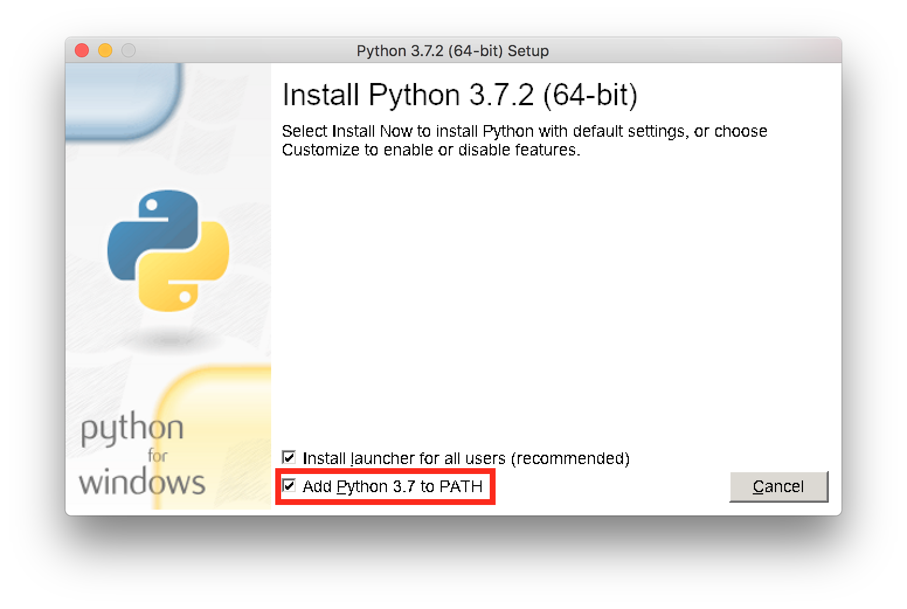

============
Dependencies
============

Make sure that Python 3 and ``pip3`` are installed.

If Python 3 is already installed, update ``pip3`` to the latest version with
the following command, run in a Terminal window (macOS/Linux) or in Command
Prompt (Windows):

**macOS/Linux:**

.. code-block:: bash

   pip3 install --upgrade pip

**Windows:**

.. code-block:: bat

   pip install --upgrade pip

Installing Python 3
===================

For most new Linux distributions, Python 3 should come pre-installed.

For macOS or Windows, please go to the `official Python website`_ and download
the latest version of Python 3 (as of the time of writing, 3.7.3). Run the
installer downloaded from this site and follow the instructions on-screen.

.. _`official Python website`: https://www.python.org/downloads/

Important: Special Windows Installation Instructions
----------------------------------------------------

When installing Python 3 on Windows, **make sure** to check the following
checkbox ("Add Python 3 to PATH"), which will appear on the first step of the
installation process:

This ensures that Python 3 and ``pip3`` are available from the Command Prompt.
