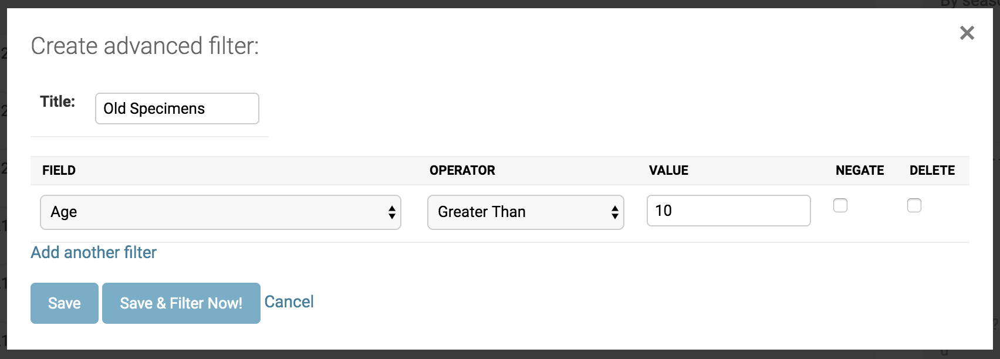
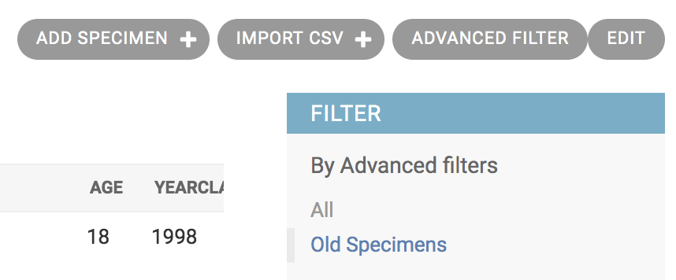

===============================================
Advanced Filtering with Django Advanced Filters
===============================================

PyTrackDat databases include the `Django Advanced Filters`_ module, which
allows for creating and saving custom filters for data in the database.

To create a filter for a particular table, first click on the dashboard entry
for the table to access the table-specific management page. Then, click the
"Advanced Filter" button to create a new advanced filter.

Make sure to **name** the filter before saving it. After adding any filters you
may want, click "Save" to store the filter. This filter will now be accessible
under the chosen name for future use, in the table-specific management page.

.. _`Django Advanced Filters`: https://github.com/modlinltd/django-advanced-filters
