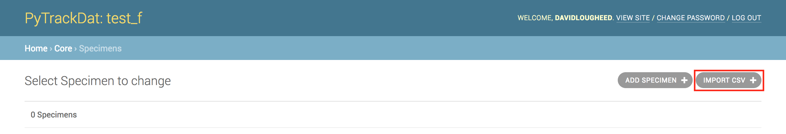

===============
Data Management
===============

Importing Data
--------------

To import data into a particular table, first click on the dashboard entry for
the table to access the table-specific management page. An "Import CSV" button
will be present in the upper left corner.

Clicking on this button will bring you to the upload page, where a
CSV-formatted file can be uploaded. Rows in the CSV file will be added to the
database, assuming the CSV file is **formatted correctly**.

Exporting Data
--------------

To export data from a particular table, first click on the dashboard entry for
the table to access the table-specific management page. Select all data that
you wish to export using the checkboxes available.

.. figure:: ../_static/ptd_export.png
   :width: 600
   :alt: PyTrackDat Export

Then, use the dropdown action menu to select the "Export selected as CSV"
action and click "Go". This will download a CSV-formatted file onto your local
computer.

.. figure:: ../_static/ptd_download_csv.png
   :width: 600
   :alt: PyTrackDat Download
