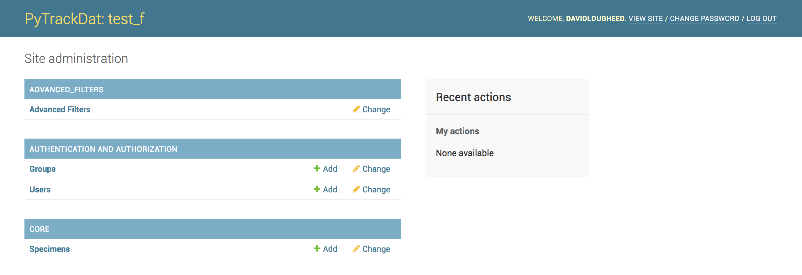

============
Introduction
============

PyTrackDat databases are built on top of the `Django framework`_, and
specifically the built-in Django administration system.

When a PyTrackDat database is running, it should be accessible via the
configured URL (in the case of production builds) or the URL ``localhost``
during local testing.

When this URL is first accessed, a log in page will appear:

.. figure:: ../_static/ptd_login.png
   :width: 300
   :alt: PyTrackDat Log In

Enter the administrative credentials you provided to the ``ptd-generate``
script to access the main dashboard:

This dashboard provides access to all tables in the database via a web
interface. Filtering, importing, and exporting options are also provided for
each table.

.. _`Django framework`: http://djangoproject.com
