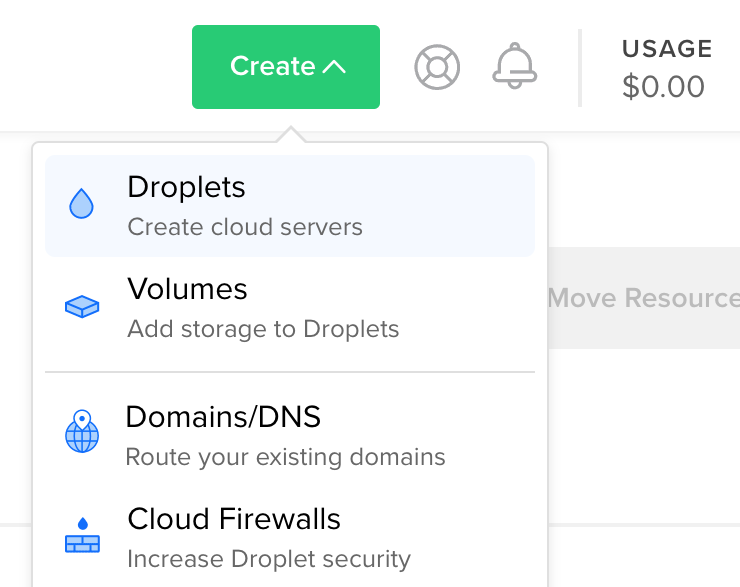
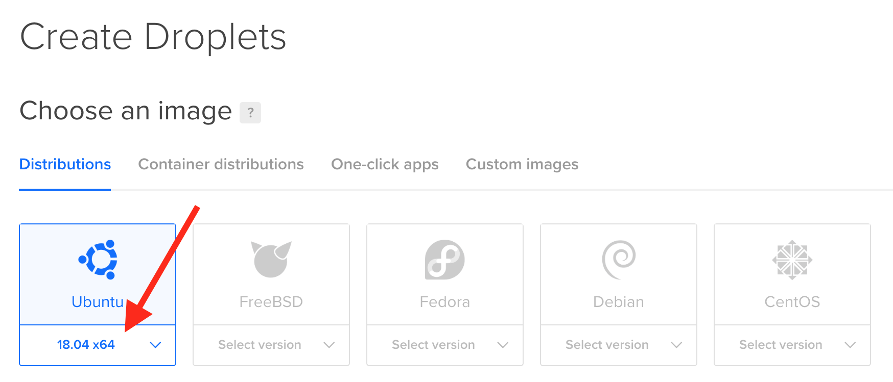
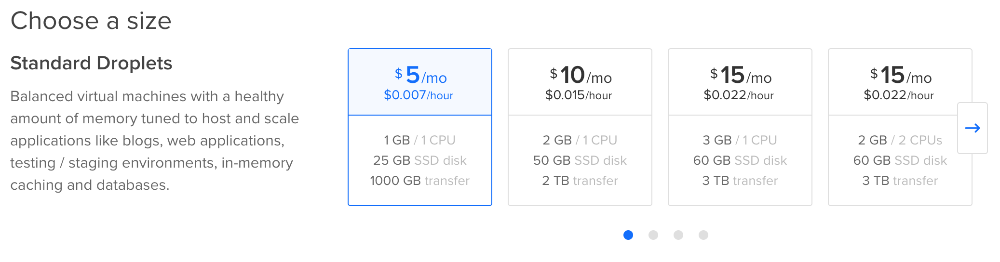
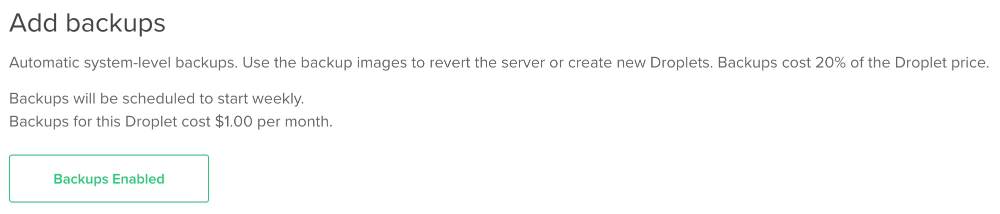
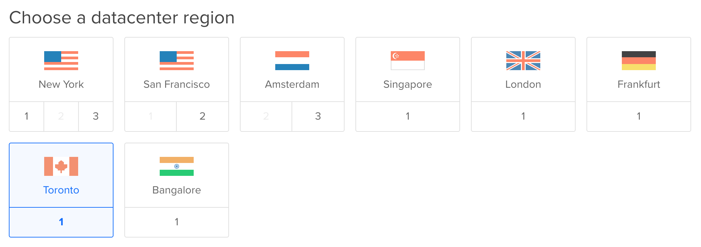
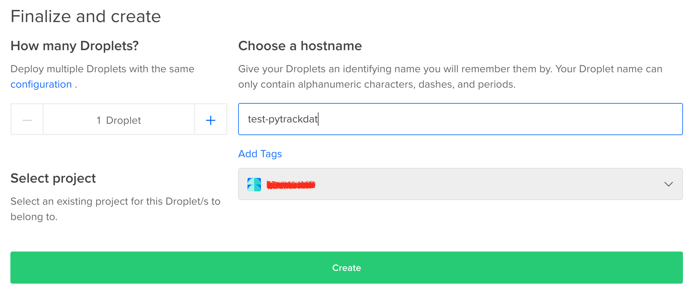

=================================
Step 5: Deploying the Application
=================================

It is now time to deploy the final version of the application on a server. This
allows the application to be accessed at all times, from anywhere connected to
the internet. User accounts are still used to restrict access to the data. Just
because the server is publically accessible doesn't mean the data are!

There are multiple options for deployment. Below is a guide for deploying on
a new "Virtual Private Server" (VPS) on the DigitalOcean service. For more
advanced users, there is also a guide for deploying on an existing server
(though many of the steps will be similar to DigitalOcean setup).

Instructions are written for Ubuntu Server 18.04 or 16.04 LTS; other
distributions may require slightly different procedures.

**Important Note:** DigitalOcean is **NOT** required to deploy PyTrackDat.
Any server running an operating system which can host Docker containers is
sufficient. DigitalOcean is a paid service; this may be restrictive to some.
Free options include adapting an existing computer with a world-accessible
IP address or using Amazon AWS' free tier (which only lasts 12 months.)

Deploying the End Result on DigitalOcean
----------------------------------------

DigitalOcean is a cost-effective VPS (virtual private server) hosting provider.
For $5 USD per month, users can create a server on which the created web
application and database can be hosted. For an additional $1 USD per month,
automatic backups can be enabled.

If you already have a server on which the application can be deployed, see the
section below. The DigitalOcean service provider is not specifically required
to run the application.

Deployment Step 1: Create a DigitalOcean account
^^^^^^^^^^^^^^^^^^^^^^^^^^^^^^^^^^^^^^^^^^^^^^^^

Create a DigitalOcean account on their `signup page`_. Confirm the email used
to create the account.

Make sure to enter in payment details that will allow a recurring charge of $5
USD per month (as of the time of writing, the cheapest Droplet/VPS that one can
create) for hosting the application.

.. _`signup page`: https://cloud.digitalocean.com/registrations/new

Deployment Step 2: Create a new droplet (virtual machine)
^^^^^^^^^^^^^^^^^^^^^^^^^^^^^^^^^^^^^^^^^^^^^^^^^^^^^^^^^

Once logged into the DigitalOcean dashboard, create a new virtual machine by
clicking the "Create" button and selecting "Droplets".

Select "Ubuntu 18.04 x64" for the operating system.

For PyTrackDat, the smallest droplet size ($5 USD per month) is more than
adequate, and the most cost effective solution:

For an additional $1 USD per month, automatic backups can be enabled to keep
historical versions of the whole droplet. This may be useful for data integrity
and restoring purposes.

Choose a data centre region closest to where most users will be accessing the
database, for maximum performance.

Finally, choose a hostname, which can only contain alphanumeric characters,
dashes, and periods. This uniquely identifies the droplet within the account,
and press "Create".

An email will be sent to the address used to register the account. It will
contain the newly-created droplet's IP address (4 numbers, separated by
periods) and root password. These are used for **logging in** to the droplet,
and for creating the **production** (final) version of the PyTrackDat
application, which will be uploaded to the server.

.. figure:: ../_static/email.png
   :width: 500
   :alt: New Droplet Email"
