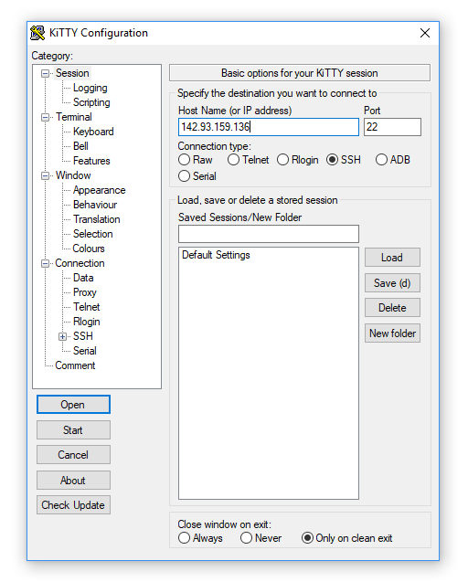

.. _kitty:

===================
KiTTY Mini Tutorial
===================

KiTTY is a tool for logging into and administering remote servers via a
command-line interface on a Windows computer. During the deployment phase of a
PyTrackDat application, you must log into a server or droplet in order to
prepare the server for the PyTrackDat application and deploy the application
itself.

To download the utility, visit `KiTTY's download page`_ and download
``kitty_portable.exe``.

Open KiTTY, and the main window (used to log into a server) will appear.

For the host name, enter the IP address of the droplet (or the server) being
accessed.

You may get a popup menu warning you about signing into an unknown server. This
occurs at the first login. It is safe to proceed by pressing "Yes".

.. figure:: ../_static/kitty2.png
   :width: 600
   :alt: KiTTY 2

You will now be prompted for a username, and then a password for the server.
Use the username and password provided to you when the droplet was created. If
this is not your first time signing in, these may have changed (per the
DigitalOcean setup guide).

.. figure:: ../_static/kitty3.png
   :width: 500
   :alt: KiTTY 3

If you successfully authenticate, you will be presented with a command-line
interface for the remote server. This can be used to run the commands which
are needed to set up PyTrackDat on the remote server (from the main tutorial).

.. figure:: ../_static/kitty4.png
   :width: 500
   :alt: KiTTY 4

If you are done accessing the server, you can exit by closing the KiTTY window.

.. _`KiTTY's download page`: http://www.9bis.net/kitty/?page=Download
