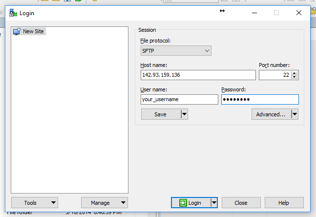
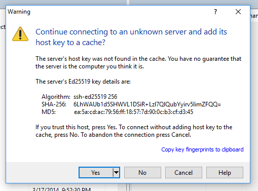
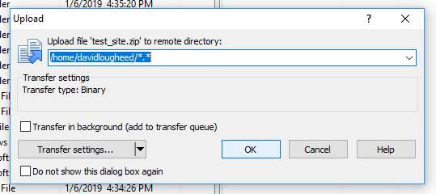
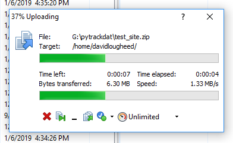
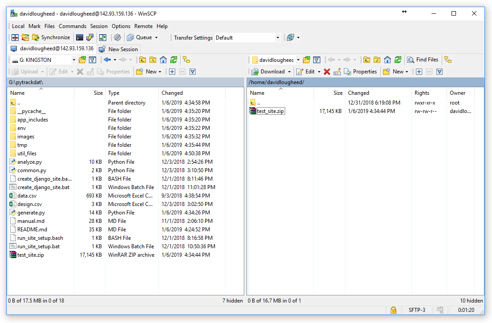

.. _winscp:

=========================================
WinSCP Mini Tutorial for PyTrackDat Setup
=========================================

Visit `WinSCP's download page`_ and download the portable WinSCP version. Make
sure to extract the WinSCP ``.zip`` file before running the executable
``WinSCP.exe`` inside. This executable allows for the copying of files to
remote servers.

Once WinSCP has been downloaded, double click it to open it. It will show a
window for logging into a server.

For the host name, enter the IP address of the droplet (or the server) being
accessed. For the username and password, use the username and password used to
remotely log into the droplet or server. Then, click Login.

You may get a popup menu warning you about signing into an unknown server. This
occurs at the first login. It is safe to proceed by pressing "Yes".

The main window will now be in focus. WinSCP will show a listing of files on
the remote server as well. If the droplet or server is newly created, there
may not be any files visible yet.

In the left-hand pane, locate the ZIP file containing your site using the
location dropdown and popup menus (in the screenshot, ``G: KINGSTON`` is the
location and ``site_name.zip`` is the ZIP file in question) and press the
Upload button.

.. figure:: ../_static/winscp3.png
   :width: 600
   :alt: WinSCP 3

After the "Upload" button is pressed, a small window will appear with upload
settings. The defaults are fine; press "OK" to continue.

After pressing "OK", a progress bar will appear showing the file transfer. When
this is done, the file is uploaded!

Now that the file is uploaded, it should be visible on the remote server, i.e.
the right-hand pane:

If you see the file on the right, the ZIP file is now on the server! You can
exit out of WinSCP and proceed with unzipping and setting up the PyTrackDat
application.

.. _`WinSCP's download page`: https://winscp.net/eng/downloads.php
